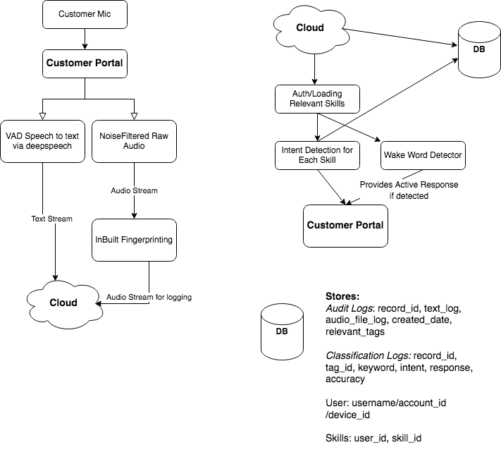

# Assistant Intent Classification
## Docker Setup Instructions

Use The Makefile to run 
``
make run-core
``


## Local Setup Instructions

Install the requirements via
`pip3 install -r requirements.txt` and run the jupyter notebook

### Running the notebook
Download Glove for word embeddings
```sh
mkdir GloVe
curl -Lo GloVe/glove.840B.300d.zip http://nlp.stanford.edu/data/glove.840B.300d.zip
unzip GloVe/glove.840B.300d.zip -d GloVe/
```

and 
Download infersent for sentence embeddings
```sh
mkdir encoder
curl -Lo encoder/infersent1.pkl https://dl.fbaipublicfiles.com/infersent/infersent1.pkl
```

Run the classifier notebook classifier.ipynb to load and view the data.

### Running the Server 
Current Accuracy:

Download deepspeech-0.7.3-models from deepspeech directory. The files that should be included are 
```
├── deepspeech-0.7.3-models.pbmm
├── lm.binary
├── output_graph.pb
├── output_graph.pbmm
├── output_graph.tflite
└── trie
```

Download ffc_keras_model and infraset_model.torch from the notebook 


## Architecture Documentation
One Architecture Diagram: https://people.eecs.berkeley.edu/~nmalkin/alva/architecture

Another Design/Diagram

