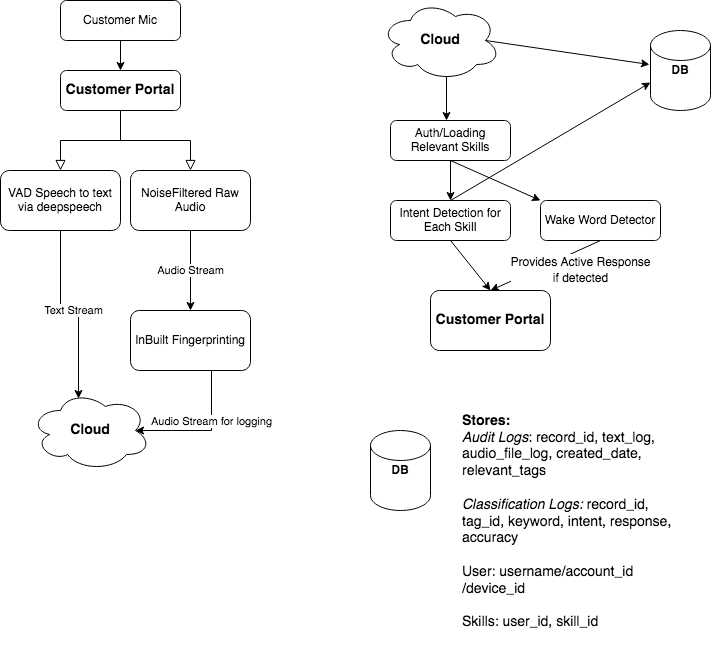

# Assistant Intent Classifier
## Code Structure
```
├── Makefile
    - Common useful commands
├── app
    - Contains server code for Web interface 
├── notebooks
- Jupyter notebooks used to create/train the models
├── server.py
-  Run the Web Interface server locally
├── skills
- Skills created such as shopping and time
├── transcription
- transcription via deepspeech 
```
## Local Setup Instructions

Install the requirements via
`pip3 install -r requirements.txt` and run the jupyter notebook

The code can either be run as a live server mode, streaming mode, or direct text mode.


and run server via
```python
pip3 server.py
```

To get the models required to run, download the two model files at https://drive.google.com/drive/folders/16glf6J5UXeyCPusQR2xr8GGrD0r1hvXT
and insert them into the skills folder.
- TODO simplify this process


## Architecture Documentation
One Architecture Diagram: https://people.eecs.berkeley.edu/~nmalkin/alva/architecture

Another Design/Diagram

